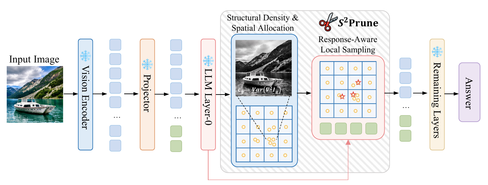

# S²Prune

Reference implementation of S²Prune, a training-free visual-token pruning method for multimodal large language models. S²Prune separates spatial capacity allocation from local representative selection: regional Laplacian complexity determines how many tokens each region receives, while early representation change (ERC) selects one representative inside each allocated local cell.

This release contains the Qwen2.5-VL-7B-Instruct implementation used for the main experiments. It does not contain model weights, datasets, generated predictions, or author-identifying metadata.

<p align="center">
  
</p>

S²Prune allocates the visual-token budget from regional structural density, then performs response-aware local sampling after decoder Layer 0 before continuing through the remaining layers.

## Method

The released configuration uses a fixed 672 × 672 image input and obtains 24 × 24 = 576 decoder-visible visual tokens after Qwen2.5-VL PatchMerger. For a coarse region `g`, structural complexity is

```text
c_g = Var(Laplacian(I_g)).
```

Each region first receives one token. The residual budget is allocated proportionally to the per-image min-max normalized complexity using capacity-aware largest-fractional-remainder redistribution. The released budget/grid pairs are:

```text
B=32   -> 4x4 coarse regions
B=64   -> 5x5 coarse regions
B=128  -> 8x8 coarse regions
B=192  -> 9x9 coarse regions
```

Each region is recursively partitioned into exactly `B_g` non-overlapping cells. The full visual sequence runs through decoder Layer 0, and the local ERC score is

```text
s_i = ||h_i^1 - h_i^0||_2.
```

The maximum-ERC token is retained in each cell. Selected indices are sorted in their original decoder-visible sequence order. Physical sequence deletion is applied after Layer 0 and before Layer 1; hidden states, attention masks, original M-RoPE position IDs, and the Layer-0 KV cache are gathered consistently. Text and special tokens are never removed.

## Environment Installation

The reported runs used Python 3.8.10, CUDA 12.1, PyTorch 2.4.1, and Transformers 4.49.0.

```bash
python -m venv .venv
source .venv/bin/activate
python -m pip install --upgrade pip
python -m pip install -r requirements.txt
python -m pip install -e .
```

The exact package versions are pinned because Qwen2.5-VL decoder and cache APIs differ across Transformers releases.

## Model Preparation

Download `Qwen/Qwen2.5-VL-7B-Instruct` from Hugging Face or provide an equivalent local snapshot. Do not place model weights inside this repository.

```bash
export MODEL_PATH=Qwen/Qwen2.5-VL-7B-Instruct
```

The evaluator loads the model in BF16 with eager attention, matching the released experiments.

## Quick Start

Run the three budget configurations on one image before full evaluation:

```bash
python scripts/smoke_test.py \
  --model-path "$MODEL_PATH" \
  --image /path/to/example.jpg \
  --device cuda:0
```

Expected token-count checks:

```text
PASS B=32  grid=4x4 visual=576->32
PASS B=64  grid=5x5 visual=576->64
PASS B=128 grid=8x8 visual=576->128
PASS B=192 grid=9x9 visual=576->192
```

## Evaluation

MMBench EN development, B=64:

```bash
python scripts/evaluate.py \
  --model-path "$MODEL_PATH" \
  --dataset MMBench \
  --data-root /path/to/MMBench \
  --split dev \
  --mmbench-lang en \
  --budget 64 \
  --device cuda:0 \
  --output-dir outputs/mmbench_en_b64
```

TextVQA validation, B=64:

```bash
python scripts/evaluate.py \
  --model-path "$MODEL_PATH" \
  --dataset TextVQA \
  --data-root /path/to/TextVQA \
  --budget 64 \
  --device cuda:0 \
  --output-dir outputs/textvqa_b64
```

POPE adversarial, B=128:

```bash
python scripts/evaluate.py \
  --model-path "$MODEL_PATH" \
  --dataset POPE \
  --data-root /path/to/POPE \
  --image-dir /path/to/coco/val2014 \
  --split adversarial \
  --budget 128 \
  --device cuda:0 \
  --output-dir outputs/pope_adversarial_b128
```

Native loaders are included for VQAv2, TextVQA, VizWiz, MMBench, ScienceQA, POPE, and MME. MMMU, GQA, and MM-Vet use a normalized JSON or JSONL manifest to avoid redistributing benchmark-specific cached images. Each manifest row must contain `id`, `image_path`, `question`, and either `answer` or `answers`; multiple-choice rows additionally contain `options` as `[label, text]` pairs.

```bash
python scripts/evaluate.py \
  --model-path "$MODEL_PATH" \
  --dataset MMMU \
  --manifest /path/to/mmmu_manifest.jsonl \
  --budget 64 \
  --device cuda:0 \
  --output-dir outputs/mmmu_b64
```

The evaluator writes:

```text
per_sample.csv   predictions, scores, selected indices, and regional budgets
summary.json     aggregate local metric and run metadata
run_config.json  complete command-line configuration
image_cache/     decoded parquet images when required
```

MM-Vet predictions are intentionally assigned no local score because its official evaluation uses an external judge. Use `per_sample.csv` with the official evaluator. For all benchmarks, official leaderboard submission scripts remain the authoritative metric implementation.

## Reproducibility Checks

Run the deterministic allocator regression tests:

```bash
python -m unittest discover -s tests -v
```

Run the anonymity scan before publishing changes or creating an archive:

```bash
python scripts/check_anonymity.py
```

## Directory Structure

```text
S2Prune/
├── assets/
│   └── s2prune_framework.png      method overview for the README
├── configs/
│   └── qwen2_5_vl_7b.json       released budget and model configuration
├── s2prune/
│   ├── allocation.py            Laplacian allocation and recursive-cell ERC selection
│   ├── data.py                  dataset loaders and prompt formatting
│   ├── metrics.py               answer parsing and local metrics
│   ├── qwen.py                  Qwen input construction and physical Layer-0 pruning
│   └── vizwiz_eval.py           official VizWiz/VQA-style local metric
├── scripts/
│   ├── check_anonymity.py       release metadata scanner
│   ├── evaluate.py              evaluation entry point
│   └── smoke_test.py            token-count and generation smoke test
├── tests/
│   └── test_allocation.py       deterministic allocator regression tests
├── pyproject.toml
└── requirements.txt
```

## Implementation Notes

The Qwen vision tower internally permutes patch groups for window attention and applies the corresponding inverse permutation after PatchMerger. S²Prune introduces no additional reordering before the decoder. The retained visual sequence is an order-preserving subsequence of the original decoder-visible sequence, and original M-RoPE coordinates are gathered without renumbering.

The Laplacian min-max denominator is clamped by FP32 machine epsilon (`1.1920929e-7`). Allocation falls back to uniform weights only when the eligible score sum is no greater than FP64 machine epsilon (`2.2204460e-16`). Recursive cells split the largest splittable rectangle along its longer dimension, prefer rows on equal side lengths, and use an integer floor midpoint.
